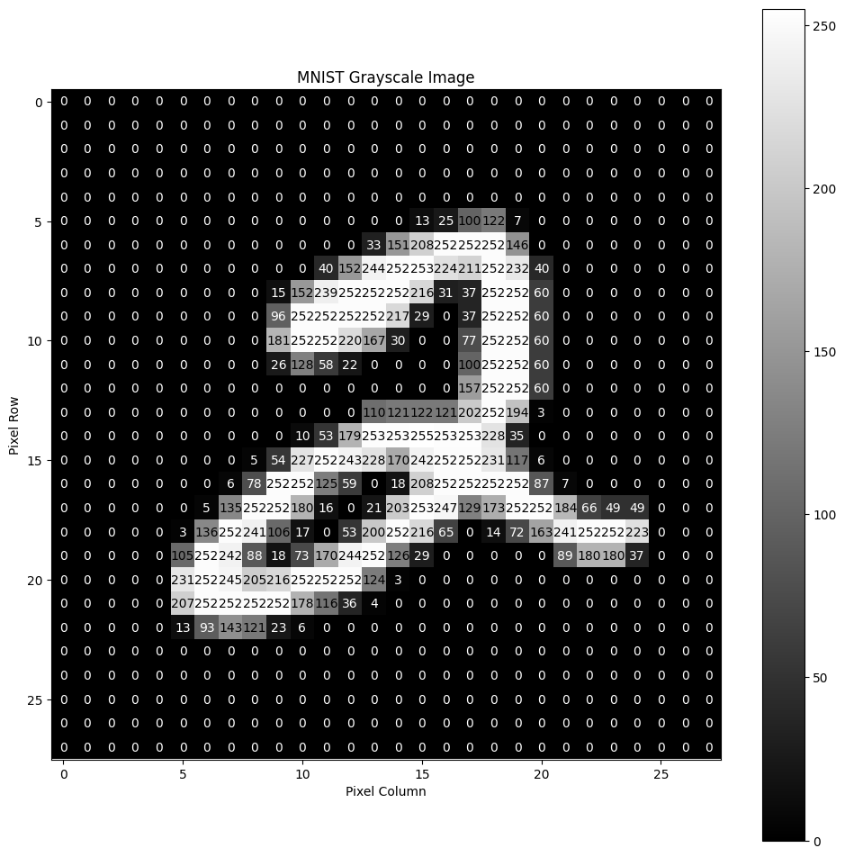

# How Machines Think

---

### Introduction

What will we be covering?

- Why our brains are amazing
- How does that inform machine learning?
- What happens when a model answers a question?
- How did it "learn" to answer those questions?

<small> Disclaimer: Lots of this is inspired by [3Blue1Brown](https://www.youtube.com/watch?v=aircAruvnKk) he has a video covering much of what I'll be talking about.</small>

---

### Our Brains Are Amazing

Forget about machine learning for a moment. 

**Goal**: Identify the following images.

---

Any ideas what we're looking at?

---

How about now?

---

## Question: Why was that so much easier?

notes: It seems like a dumb question but I'd argue its pretty profound

---

## 2 Reasons:

- Context
- Pattern Recognition

---

Let's appreciate our brains for a second!

notes: photo cells in the eye stimulate your nervous system, which in turn stimulates neurons in your brain, through a dizzying amount of electro-chemical reaction to somehow inform you that these are numbers

---

Now what if I asked you to write a piece of software to do this task?

---

We're all smart programmers, let's try!

---

What does our data look like? 

notes: 28x28 image as a 2d array. 0 represents a completely dim pixel, 255 represents a fully lit one -- plotted on a graph looks something like this. Lets hear some ideas for how we'd write an image identifier 

---

Let's look at a solution I wrote

notes: break out into google colab notebook

---

Question: Is this how your brain solves this problem?

notes: The question you have to ask here to get to machine learning is...

---

Let's use the way the brain works to inform the architecture of our new program.

---

So what **does** our brain do?

note: we said it before -- visual cortex, central nervous system which triggers our brains to have a set of neurons activate

---

a *set of* neurons might activate in response to a particular stimulus

notes: The stimulus pass through our neurons might light up entire regions of the brain with activity. So there's this idea of a cascading signal lighting up particular pathways

---

Brains are complex. 

I don't even really understand that last image.

notes: Since this is complex we need to generalize it to something we can implement. Like many things in software engineering, math is the solution here

---

To simplify, we have lots of data points and we want to find a way to generalize this data

notes: In math when we have some data set and we want to determine given some input, x what will the output y be, we use a function

---

eg: this data generally fits a sine wave

$$y = 3sin(x)$$

notes: so here our best approximation of this data is a Sine wave times 3, so if we input 150 degrees we get roughly 0.5

---

But each image has 784 ($28\times28$) inputs!

notes: so the problem here is that we're dealing with what we call high dimensionality. each pixel of the image has to be an input to this function. In machine learning you might call that a "feature"

---

What if we used linear functions?

$$y = \sigma(w_1 x_1 + w_2 x_2 + ... +  w_n x_n)$$

notes: if we need a high number of variables, the best solution that comes to mind is a linear system of equations. Here x represents a single pixel and y is if our neuron is activating or not

---
$$y = \sigma(w_1 x_1 + w_2 x_2 + ... +  w_n x_n)$$

### What about $\large w$?

notes: we're also going to define this other number, called the weight. It essentially represents how much we want this particular pixel to effect if our neuron becomes active or not.

---

But we have many neurons!

notes: our brains are comprised of 86 billion neurons, so maybe our piece of software should as well, but why? Well the idea is that maybe we'll be able to teach our software to light up particular neurons when it see an image of a 2, and in turn identify it. We'll cover that when we talk about training

---

Let's add more neurons, and while we're at it, lets add some layers too!

<video src="https://giant.gfycat.com/LimpingDarlingFinnishspitz.mp4"/>

notes: So like before you can imagine that our input layer is taking in each pixel, and then we pass that along to the next layer in this network, which might output a high number for some neurons and a low number for other neurons, and then pass that along, which eventually reaches our last, output layer. 

---

<video src="https://thumbs.gfycat.com/HandyBraveAnophelesmosquito-mobile.mp4" />

Intuitively though, why are we using multiple layers like this?

notes: our hope here is that if the first layer sees every pixel, and thus is activated when a pixel is bright or dim, then maybe in the next layer a particular neuron might be active when a specific cluster of pixels is lit, which might represent a piece of a shape, like a loop or a line, and then maybe the next layer will stitch those pieces into a shape like a loop or a line

---

Ok great! lets try it!

notes: Break into colab notebook after walking through the code. Keras gives us some nice libraries to represent these layers as objects and call-back functions we can pass to each other

---

I thought these things were supposed to be smart?...

We need to _train_ our network!

<video height=480 src="https://giant.gfycat.com/ContentDarlingCub.mp4" />

notes: we had some trouble... we never trained our network, and just initialized all our weights randomly... what if we start to nudge all the weights a bit so they start to give better results? To do this, we need to know how wrong we are. So, we need a new function, called the "Cost" which helps define how wrong our network is. What if we just take a simple sum of the difference between our expected output and the actual output for our last layer? when that number is small, then we performed well and when its large we performed poorly. Not only can we use this cost function to tell if 1 output is bad, but we can find the average output of the cost function and that should tell us generally how badly the network is performing on any particular training example.

---

We have to tell the network where it went wrong

<video src="https://giant.gfycat.com/EquatorialSpicyEgg.mp4" />

notes: So, if we want the network to perform better, then we need a way to minimize the output of this cost function. If you remember your calculus well, you might remember that there is a way to find the direction of steepest ascent in a function; its called the gradient. Naturally if you wanted to find the opposite you can just take the negative gradient. What we have now is a method to find some set of values that will minimize, or lower, the output of our cost function. 

---

So lets try training!

notes: Train the network live, and then show an inference in the Colab notebook.

---

Remember when we talked about our hope for what each layer might do?

notes: earlier in the presentation we spoke about how the hope was that a particular neuron might detect part of a shape, and the next layer would piece those shapes together? 

---

Lets actually check if our hope was right

notes: this is what the inside of our simple neural network's brain looks like. this is the set of weights for one of our layers with 16 neurons in it. It's pretty easy to see that our hope for how this was going to work, versus how it actually works was way off. Here the dark spots are the parts deemed less important and the brighter spots are where the network is deciding to focus. the shapes we're seeing are more or less random.

---

What we just covered is about 1% of the depth of neural networks.

notes: there is so much to learn here, our example was one of the most basic forms of neural networks, a multilayers perceptron. Modern networks have so many interesting tricks up their sleeve, but the good part is a lot of them are an abstraction on these base concepts, more or less. If you're interested in learning more about this definitely check out 3Blue1Browns videos on this topic, he's way more intelligent than me, and that video goes into way more depth.

---

If you want to play with the notebook / code from this presentation: 

Or go to:
https://www.github.com/m-triassi/machine-learning-basics